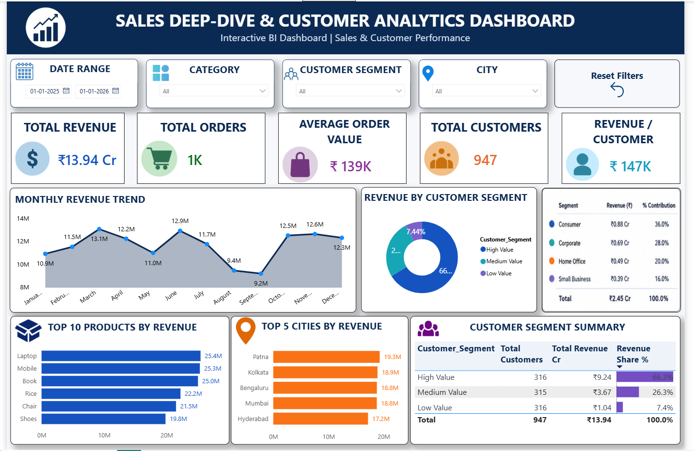

# 📊 Data Analyst Internship Portfolio

### End-to-End Sales Data Analytics Project

**Anchal Teepa**

This repository showcases my complete Data Analytics Internship journey, covering data cleaning, exploratory data analysis, SQL business analysis, customer segmentation, interactive Power BI dashboarding, statistical validation, and business storytelling.

## 🚀 Project Journey

## 🚀 Project Journey

| Task | Project | Link |
|---|---|---|
| Task 1 | Data Immersion & Wrangling | [View Project]([https://github.com/AnchalTeepa/End-to-End-Data-Wrangling-Project](https://github.com/AnchalTeepa/AnchalTeepa-DataAnalyst-Internship-Portfolio/tree/main/Task1-data-wrangling)) |
| Task 2 | Exploratory Data Analysis & Business Intelligence | [View Project](https://github.com/AnchalTeepa/AnchalTeepa-DataAnalyst-Internship-Portfolio/tree/main/Task2-EDA-BI) |
| Task 3 | Deep-Dive Analysis & Interactive Dashboarding | [View Project](https://github.com/AnchalTeepa/AnchalTeepa-DataAnalyst-Internship-Portfolio/tree/main/Task3-Deep-Dive-Dashboard) |
| Task 4 | Data Storytelling & Statistical Validation | [View Project](https://github.com/AnchalTeepa/AnchalTeepa-DataAnalyst-Internship-Portfolio/tree/main/Task4-Data-Storytelling) |
| Task 5 | Capstone Integration & Portfolio Finalization | [View Project](https://github.com/AnchalTeepa/AnchalTeepa-DataAnalyst-Internship-Portfolio/tree/main/Task5-Capstone-Portfolio) |

---
## 🔄 End-to-End Analytics Workflow

**Raw Data → Data Cleaning → EDA → SQL Analysis → Customer Segmentation → Power BI Dashboard → Statistical Validation → Business Recommendations**

---

## 🛠️ Tech Stack

**Python • Pandas • NumPy • SQL • SQLite • Power BI • Power Query • DAX • SciPy • Matplotlib • Seaborn • Git • GitHub • Jupyter Notebook**

---

## 📊 Key Results

- Total Revenue: **₹13.94 Cr**
- Total Orders: **1,000**
- Total Customers: **947**
- Average Order Value: **₹139K**
- Revenue per Customer: **₹147K**
- High Value Customers contributed **66.3% of total revenue**

---

## 📊 Interactive Power BI Dashboard

The interactive dashboard provides a consolidated view of sales performance, customer segmentation, product performance, monthly trends, and geographic insights.

### Dashboard Features

- KPI Monitoring
- Date Range Filtering
- Category Filtering
- Customer Segment Filtering
- City Filtering
- Reset Filters Functionality
- Monthly Revenue Trend
- Product Performance
- Customer Segmentation
- Geographic Analysis

---

## 💡 Key Business Insights

- **High Value customers generate 66.3% of total revenue**, despite representing approximately one-third of the customer base.
- **Laptop** emerged as the highest revenue-generating product.
- **Electronics** was the highest revenue-generating category.
- **Patna** emerged as the strongest geographic market.
- Statistical testing showed that **gender does not significantly influence average order sales**.

---

## 🎯 Business Recommendations

- Retain High Value customers through loyalty and personalized engagement.
- Grow Medium Value customers using targeted promotions and cross-selling.
- Prioritize inventory and promotions for high-performing products.
- Strengthen strategies in top-performing geographic markets.
- Use behavioral and value-based customer targeting instead of relying primarily on gender segmentation.

---

## 📑 Final Presentation

The final stakeholder presentation summarizes the complete analytics journey from raw data to actionable business recommendations.

📂 [View Final Sales Analytics Presentation](Task5-Capstone-Portfolio/Final_Sales_Analytics_Presentation.pptx)

---

## 📚 Key Learnings

A detailed summary of the technical and analytical skills developed throughout the internship:

📘 [View Key Learnings & Technical Skills](Task5-Capstone-Portfolio/KEY_LEARNINGS.md)

---

## 🎯 Portfolio Outcome

This project demonstrates a complete end-to-end Data Analytics workflow:

**Reliable Data → Meaningful Analysis → Interactive Insights → Statistical Evidence → Actionable Business Decisions**

Through this internship, I strengthened my practical skills in:

**Python | SQL | Power BI | Statistics | Data Visualization | Business Intelligence | Data Storytelling**

---

## 👩‍💻 About Me

I am **Anchal Teepa**, a Computer Science Engineering graduate with a strong interest in **Data Analytics and Business Intelligence**.

I enjoy transforming data into meaningful insights and using analytics to support data-driven decision-making.

### Connect With Me

🔗 [GitHub](https://github.com/AnchalTeepa)

🔗 [LinkedIn](https://www.linkedin.com/in/anchal-teepa/)

---

⭐ Thank you for exploring my Data Analyst Internship Portfolio.
